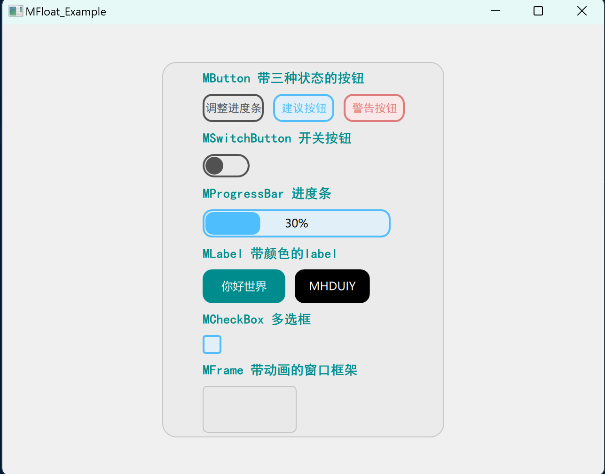

## MFloat

基于qml开发的控件库

- 颜色统一
- 动画尽可能的多（不怕花里胡哨）
- 尽力实现code过程中所需的大部分控件（基础控件，不包含组合控件）

## 效果演示

## 目前已实现和准备实现的控件

- [x] MButton   三种状态的按钮
- [x] MCheckBox 复选框
- [x] MFrame    带动画的框架
- [x] MLabel    带颜色的label
- [x] MLineEdit 行编辑框
- [x] MProgressBar 进度条
- [x] MSwitchButton 开关按钮
- [ ] MNotificationBox      通知控件
- [ ] MTitleBar 标题栏
- [ ] MBlurEffectWidget 实时模糊窗体
- [ ] MLineChart 折线图表